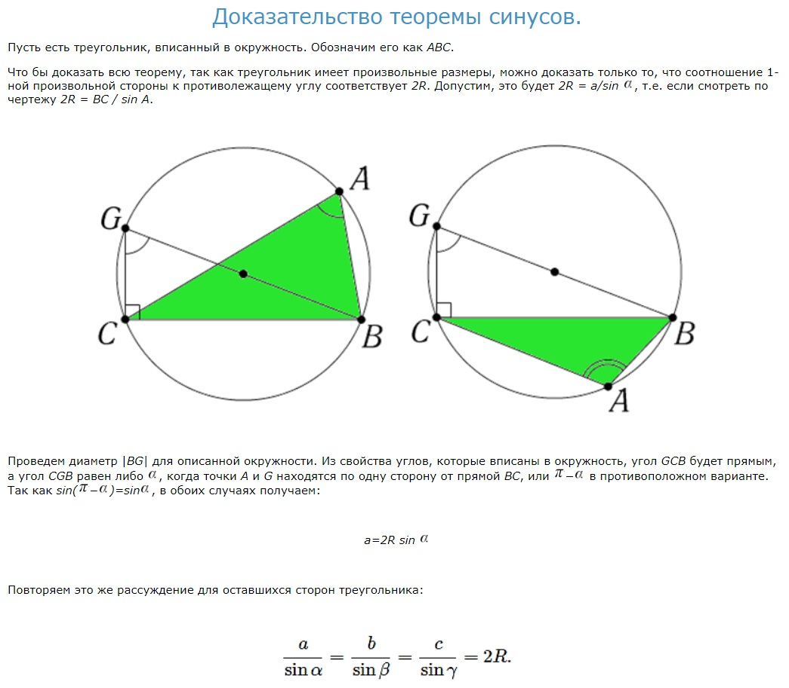

# Теорема косинусов. Вид треугольника (остроугольный, тупоугольный). Теорема синусов.
## Теорема косинусов

## Теорема синусов

<h4 id="header_6">Случай треугольника: доказательство</h4>
    
Приведём здесь элементарное доказательство, не использующее теорию интегралов. 

    
Первым подобное, чисто геометрическое, доказательство привёл Архимед, но оно было весьма сложным, с большим
        числом геометрических построений. Приведённое здесь доказательство взято из статьи Apostol, Mnatsakanian
        "Finding Centroids the Easy Way".

    
Доказательство сводится к тому, чтобы показать, что центр масс треугольника лежит на одной из медиан; повторяя
        этот процесс ещё дважды, мы тем самым покажем, что центр масс лежит в точке пересечения медиан, которая и есть
        центроид.

    
Разобьём данный треугольник 
        на четыре, соединив середины сторон, как показано на рисунке:

    

    
Четыре получившихся треугольника подобны треугольнику  с коэффициентом .

    
Треугольники №1 и №2 вместе образуют параллелограмм, центр масс которого  лежит в точке пересечения его
        диагоналей (поскольку это фигура, симметричная относительно обеих диагоналей, а, значит, её центр масс обязан
        лежать на каждой из двух диагоналей). Точка  находится посередине общей стороны
        треугольников №1 и №2, а также лежит на медиане треугольника :

    

    
Пусть теперь вектор  —
        вектор, проведённый из вершины  к центру масс  треугольника №1, и пусть вектор  — вектор, проведённый из  к точке  (которая, напомним, является
        серединой стороны, на которой она лежит):

    

    
Наша цель — показать, что вектора  и 
        коллинеарны.

    
Обозначим через  и  точки, являющиеся
        центрами масс треугольников №3 и №4. Тогда, очевидно, центром масс совокупности этих двух треугольников будет
        точка , являющаяся
        серединой отрезка .
        Более того, вектор от точки  к точке  совпадает с вектором .

    
Искомый центр масс 
        треугольника  лежит
        посередине отрезка, соединяющего точки  и  (поскольку мы разбили треугольник
         на две части равных
        площадей: №1-№2 и №3-№4):

    

    
Таким образом, вектор от вершины  к центроиду 
        равен . С
        другой стороны, т.к. треугольник №1 подобен треугольнику  с коэффициентом , то этот же вектор равен . Отсюда получаем
        уравнение:

    

    

    
откуда находим:

    

    

    
Таким образом, мы доказали, что вектора  и  коллинеарны, что и означает, что
        искомый центроид  лежит на
        медиане, исходящей из вершины .

    
Более того, попутно мы доказали, что центроид делит каждую медиану в отношении , считая от вершины.

    

    

    


